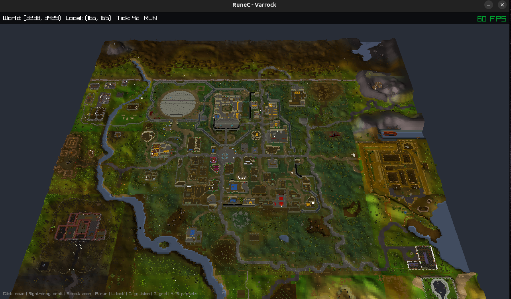

# RuneC



A faithful port of Old School RuneScape to C, rendered with [Raylib](https://www.raylib.com/). The game simulation runs as a standalone backend with zero rendering dependencies, enabling headless execution for high-performance simulations, bots, and RL training.

Currently rendering the Varrock region with terrain, buildings, objects, player model with animations, and tile-based collision from the OSRS cache.

## Architecture

```
rc-core/      Game backend (pure C, no render deps)
              Tick loop, pathfinding, combat, prayer, skills, items

rc-viewer/    Raylib frontend
              3D rendering, camera, input, asset loading, animation

tools/        Python scripts for exporting assets from the OSRS cache

data/         Exported assets (terrain, models, animations, collision)
```

The backend exposes a simple API — `rc_world_create`, `rc_world_tick`, player input functions — and the frontend reads game state each frame to render it. This separation means the same backend can drive a viewer, an RL agent, or a test harness.

## Current State

- 25-region Varrock world (320x320 tiles) with terrain, buildings, trees, and objects
- Player model with idle/walk/run animations
- Click-to-move with BFS pathfinding respecting collision
- Orbit camera with zoom, follow mode, and presets
- Collision system with wall directions and blocked terrain matching OSRS

## Upcoming

- NPC spawning and rendering (guards, dark wizards, shopkeepers)
- Combat system (melee/ranged/magic with OSRS-accurate formulas)
- Items, inventory, and equipment
- Skills (mining, smithing, cooking, woodcutting, fishing, prayer)
- Shops, banking, NPC dialogue
- Quests (Romeo & Juliet, Demon Slayer)

## Build

```bash
mkdir build && cd build
cmake .. -DCMAKE_BUILD_TYPE=Release
make -j$(nproc)

# Run (from project root)
cd .. && ./build/rc-viewer
```

Requires CMake 3.20+, a C11 compiler, and the exported assets in `data/`.

## Tools & References

**Built with:**
- [Raylib 5.5](https://www.raylib.com/) — rendering, input, windowing
- C11 / CMake — build system
- Python 3 — asset export scripts

**OSRS cache & references:**
- [OpenRS2](https://archive.openrs2.org/) — OSRS cache archives (b237)
- [RuneLite](https://github.com/runelite/runelite) — cache format documentation, collision flags, coordinate system, item/NPC/object definitions
- [RSMod](https://github.com/rsmod/rsmod) — tick processing order, BFS pathfinding, combat accuracy formulas, collision flag system
- [Void RSPS](https://github.com/GregHib/void) — skill implementations, Varrock content data, object interaction logic
- [runescape-rl](https://github.com/jbaileydev/runescape-rl) — fight caves C implementation with Raylib viewer, asset pipeline, animation system (direct ancestor of this project)

## License

This project is for educational and research purposes. OSRS content and cache data belong to Jagex Ltd.
